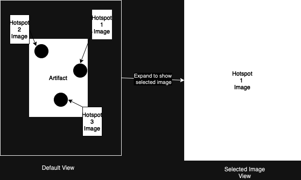

# Team Meeting Minutes 1
## Things to do for Beta 
### C# 
- Editor (Thomas + Miłosz)
  - Python to send image to editor so it knows information about the hotspots
- Hotspot Display (Sonny)
- Style UI (Sonny)

### Messages (Miłosz + Daniel)
- using function calls
  - `onHotspotPress()`
  - `onHotspotUnpress()`
  - Editor messages to work out when we have something on the editor
 
### Python (Daniel + Sergi)
- Calibration
  - Starting with mouse calibration before maybe moving onto an approach using fingers
  - Plan to make an initial strip down version using the new message calls
  - See if there are any calibration libraries
- Write more tests
  - Tests done by feeding photos with fingers in them

## UI Possible Style

## Document updates
- Rewrite [README.md](../../README.md)
  - User setup guide
  - Development guide 
