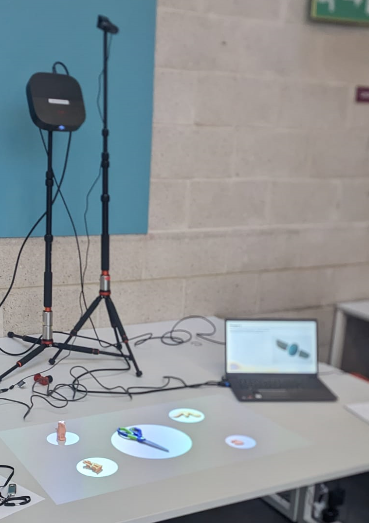

---
# Feel free to add content and custom Front Matter to this file.
# To modify the layout, see https://jekyllrb.com/docs/themes/#overriding-theme-defaults

title: Home
layout: home
nav_order: 1
---

# Welcome to the Wall Projections documentation!

This is a project in collaboration with Bristol Museums, to allow 3D printed replicas of artefacts to be interacted
with to display detailed, rich information about the touched area.

## Installation

To run Wall Projections, start [HERE]()

## Usage

To learn how to use Wall Projections, start [HERE]()

## Development

If you are interested in contributing to Wall Projections, start [HERE]()
